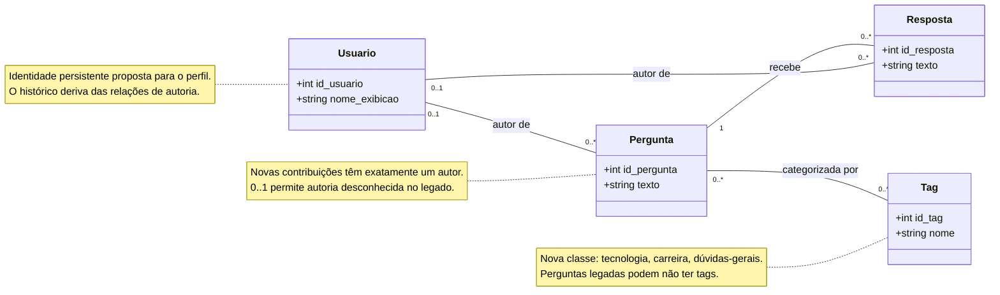
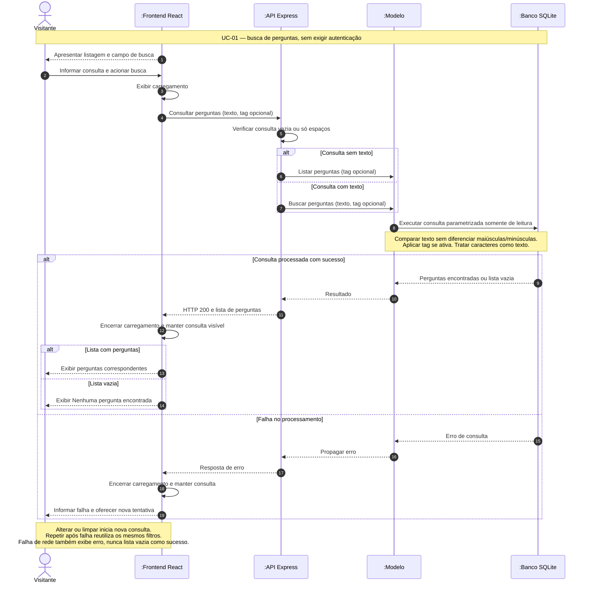
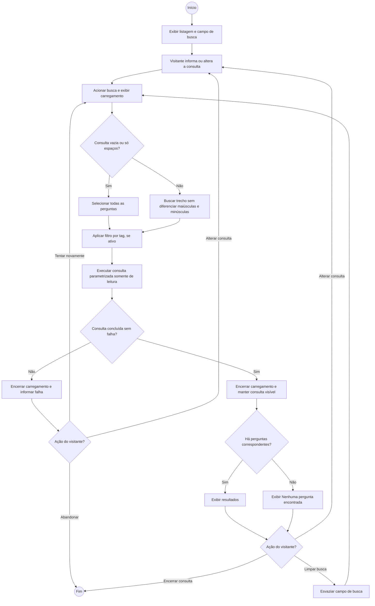
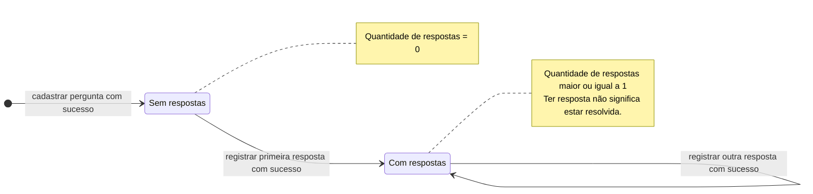

# ESM Forum

Para configurar os forks desta entrega e executar backend e frontend, consulte [INSTALACAO.md](INSTALACAO.md).

Práticas de XP: [análise de design simples](DESIGN_SIMPLES.md) e [planejamento de pair programming](PAIR_PROGRAMMING.md).

Qualidade do código: [análise SOLID do backend](ANALISE_SOLID.md).

Requisitos: [três histórias de usuário com critérios de aceitação e priorização](HISTORIAS.md).

Detalhamento: [caso de uso de busca de perguntas por palavra-chave](CASO_DE_USO.md).

O **ESM Forum** é um sistema minimalista de demonstração do livro [Engenharia de Software Moderna](https://engsoftmoderna.info). 
Ele é um fórum simples de perguntas e respostas. O objetivo é permitir que os alunos tenham um primeiro contato prático com os conceitos estudados no livro. Ou seja:

* Trata-se de um sistema com objetivo didático e, por isso, não temos a intenção de colocá-lo em produção. 
* Também não temos a intenção de implementar um sistema completo, com todas as funcionalidades possíveis.

## Frontend
 
A interface do sistema é também muito simples, conforme  mostrado abaixo. 

O frontend está implementado, usando React, em um [repositório](https://github.com/mtov/esmforum-react) separado.

## Backend

O backend do sistema, que está neste repositório, usa JavaScript e também as seguintes tecnologias:

  * [Node.js](https://nodejs.org/en), um sistema que permite a execução de programas JavaScript fora de browsers, isto é, em servidores.
  * [Express](https://expressjs.com), uma biblioteca para construção de aplicações Web em Node.js.
  * [SQLite](https://www.sqlite.org), um banco de dados relacional simples.
  * [Jest](https://jestjs.io/), um framework para implementação de testes de unidade e de integração.

### Instalação e Execução do Backend

Veja neste [link](docs/instalacao.md).

## Praticando o Conteúdo do Livro

* [Histórias de Usuários e Backlog](docs/backlog.md)
* [Arquitetura MVC](docs/arquitetura.md)
* [Diagramas de Sequência](docs/uml.md)
* Testes:
  * [Testes de Unidade](docs/testes-unidade.md)
  * [Testes de Integração](docs/testes-integracao.md)
  * [Testes End-to-End](docs/testes-e2e.md)
* [Integração Contínua](docs/ci.md)

## Diagramas UML como sketch

Os quatro diagramas abaixo comunicam as principais estruturas e comportamentos das extensões escolhidas em [HISTORIAS.md](HISTORIAS.md). São modelos leves do comportamento esperado, não uma afirmação de que as funcionalidades já foram implementadas. Votação e notificações permanecem fora do escopo destes sketches.

### Classes — domínio e extensões

Modelo conceitual para busca, tags e perfil. O backend atual é procedural: Pergunta e Resposta estão representadas no banco; Usuario ainda não possui uma tabela própria, e a autoria das perguntas usa um ID fixo. A identidade persistente de Usuario, a autoria das respostas e Tag são propostas de extensão.

As multiplicidades indicam quantos objetos podem estar associados: cada resposta pertence a uma pergunta; usuários podem ter várias contribuições; perguntas e tags têm associação muitos-para-muitos. O autor é opcional (0..1) apenas para acomodar conteúdo legado de autoria desconhecida; novas perguntas e respostas exigem exatamente um autor autenticado. As chaves estrangeiras são representadas pelas associações para evitar duplicação visual. Perfil/histórico são consultas sobre Usuario, Pergunta e Resposta, e busca é uma operação: não precisam de classes persistentes próprias. Campos de autenticação e tabelas de associação ficam fora deste sketch.

[Fonte Mermaid: classes.mmd](docs/diagramas/classes.mmd)

### Sequência — buscar perguntas por palavra-chave

Interação do [UC-01](CASO_DE_USO.md) entre visitante, interface, API, modelo e banco. Inclui consulta vazia, resultado vazio e falha de processamento. As mensagens nomeiam responsabilidades propostas, sem impor novas classes JavaScript ou um contrato HTTP definitivo. Um filtro por tag só se aplica quando a extensão de tags estiver disponível.

[Fonte Mermaid: sequencia-busca.mmd](docs/diagramas/sequencia-busca.mmd)

### Atividades — fluxo da busca

Representação leve do fluxo de atividades com `flowchart` do Mermaid: círculos marcam início/fim, retângulos representam atividades e diamantes representam decisões. Os caminhos incluem alterar, limpar e repetir a busca. A decisão de falha resume erros de comunicação ou processamento. Não há atividades paralelas obrigatórias neste caso de uso; por isso não foram adicionados forks/joins.

[Fonte Mermaid: atividades-busca.mmd](docs/diagramas/atividades-busca.mmd)

### Estados — Pergunta

Estado derivado da quantidade de respostas, sem necessidade de armazenar um atributo de estado adicional. A criação bem-sucedida inicia a pergunta sem respostas; a primeira resposta muda seu estado e as seguintes o mantêm. Falhas ao cadastrar uma resposta não alteram esse estado. Busca, leitura do perfil e categorização não mudam a condição de ter respostas. Não há estado final nem transição de exclusão: encerramento, exclusão e marcação como resolvida não foram solicitados. Perguntas já existentes têm o estado determinado por suas respostas atuais.

[Fonte Mermaid: estados-pergunta.mmd](docs/diagramas/estados-pergunta.mmd)

Os blocos acima reproduzem os arquivos `.mmd`; ao editar um diagrama, atualize também seu bloco no README. Notação baseada na documentação oficial do Mermaid: [classes](https://mermaid.js.org/syntax/classDiagram.html), [sequência](https://mermaid.js.org/syntax/sequenceDiagram.html), [fluxogramas](https://mermaid.js.org/syntax/flowchart.html) e [estados](https://mermaid.js.org/syntax/stateDiagram.html).
